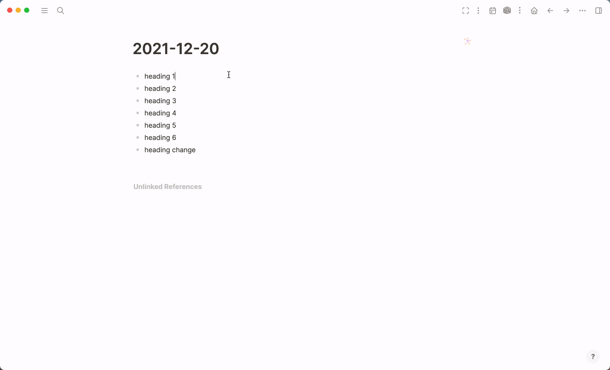

# logseq-plugin-heading-level-shortcuts

This is a very tiny plugin for Logseq to bind `cmd+0` ~ `cmd+6` to change heading levels.

## Installation

### Preparation

* Click the 3 dots in the righthand corner and go to `Settings`.
* Got to advanced and enable Developer mode.
* Restart the app.
* Click 3 dots and go to `Plugins`.

### Install plugins from Marketplace (recommended)

* Click `Marketplace` button and then click `Plugins`.
* Find the plugin and click `Install`.

### Install plugins manually

* Download released version assets from Github.
* Unzip it.
* Click `Load unpacked plugin`, and select destination directory to the unziped folder.

## Licence
MIT
